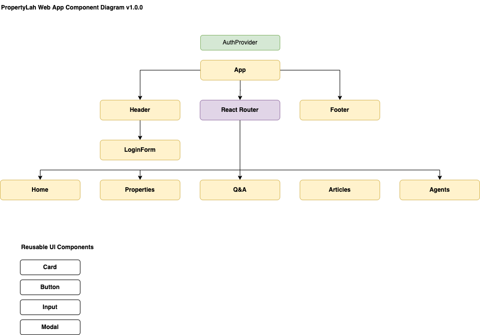

# Capstone Project - PropertyLah Web App

## Background

PropertyLah is a PropertyGuru _clone_ webapp.

## Components

Component Diagram:

## Images

There are 2 main ways of using images in React

1. Imports https://create-react-app.dev/docs/adding-images-fonts-and-files/
2. Public Folder https://create-react-app.dev/docs/using-the-public-folder/

Imports will be used for images specific to the app itself e.g. logos, image-based based icons for the UI, etc.

Public folder images will be used for general images e.g. articles, site related photos or illustrations, etc. Images will be stored in public/assets/images/.

For dynamic images e.g. property photos, we will load images directly from the backend server when image upload functionality is complete. For initial testing, it can be placed in the public folder first.

## API Endpoints

Same endpoints as Module 4 project.

## Good to Have Features

for listing improvements if we have extra time.
